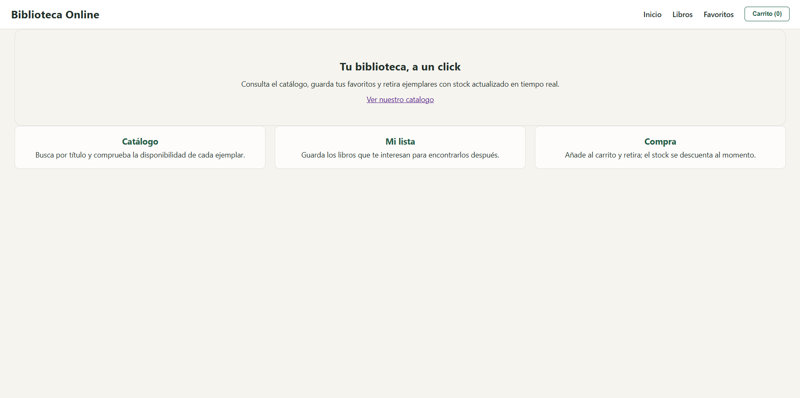
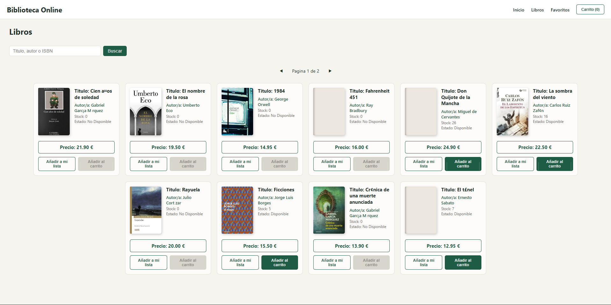
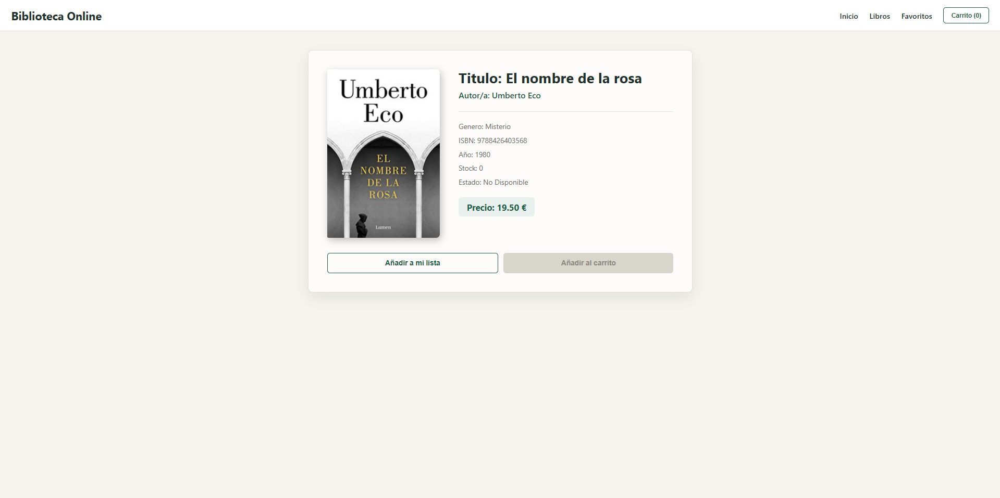
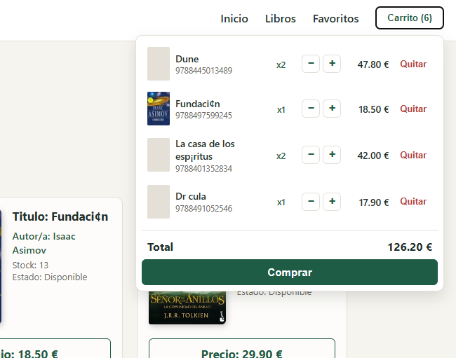

# BiblioV2 — Catálogo de Biblioteca Online

<p align="center">
  
  
  
  
  
  
</p>

## Descripción

**BiblioV2** es una aplicación web full-stack de catálogo de biblioteca con
compra de ejemplares. Permite consultar el fondo, buscar por varios criterios,
marcar favoritos y realizar pedidos que descuentan el stock de forma
transaccional.

### Qué gestiona

**Catálogo**
Cada libro almacena título, autor, ISBN, género, año, stock y precio. El ISBN es
único y sirve además para recuperar la portada desde Open Library. El listado se
pagina de diez en diez y admite búsqueda por texto sobre título, autor, ISBN o
género en una única consulta.

**Favoritos**
Lista personal de libros marcados. Se identifican por ISBN, no por id: el ISBN
identifica la obra y sobrevive a recargas del catálogo, mientras que el id
identifica la fila concreta de la base de datos.

**Carrito**
Cada línea guarda el libro completo y las unidades seleccionadas. Las cantidades
se pueden incrementar y decrementar con tope en el stock disponible; al llegar a
cero, la línea desaparece.

**Pedidos**
Un pedido agrupa varias líneas y se procesa en una única transacción. Descuenta
el stock de todos los libros, inserta la cabecera y las líneas; cualquier fallo
revierte el conjunto completo.

### Relaciones que gestiona

- Un pedido (`orders`) contiene varias líneas (`order_items`), cada una con un
  libro y una cantidad. La clave primaria compuesta `(order_id, book_id)` impide
  duplicar un libro dentro del mismo pedido.
- Cada línea referencia un libro existente mediante clave foránea. Borrar un
  pedido elimina sus líneas en cascada; borrar un libro con pedidos asociados
  falla, preservando el histórico.

### Tecnología

Backend en **Node.js con Express** y base de datos **PostgreSQL**, frontend en
**React 19 con Vite**. El código está documentado con **JSDoc** en toda la
aplicación: typedefs de las entidades, contratos entre capas y errores lanzados.

### Flujo

**CLIENTE** (React) --> **ROUTES** --> **CONTROLLERS** --> **SERVICES** --> **DATABASE** --> **POSTGRESQL**

## Requisitos del sistema

| Herramienta | Versión mínima | Comprobar con |
|-------------|----------------|---------------|
| Node.js     | 20             | `node -v` |
| pnpm        | 9              | `pnpm -v` |
| PostgreSQL  | 14             | `psql --version` |

Si no tienes pnpm:

```bash
npm install -g pnpm
```

---

## Ejecutar

### 1. Base de datos

```bash
createdb bibliov2
psql -d bibliov2 -f backend/src/v1/database/db.sql
```

Crea las tablas `books`, `orders` y `order_items`, e inserta 20 libros de prueba.
Comprobar:

```bash
psql -d bibliov2 -c "SELECT COUNT(*) FROM books;"
```

### 2. Backend

```bash
cd backend
pnpm install
```

Crear `backend/.env`:

```env
DB_USER=postgres
DB_HOST=localhost
DB_PASSWORD=tu_contraseña
DB_DATABASE=bibliov2
DB_PORT=5432
PORT=4000
```

```bash
pnpm dev
```

La API arranca en `http://localhost:4000/api/v1`.

### 3. Frontend

En otra terminal:

```bash
cd frontend
pnpm install
```

Crear `frontend/.env`:

```env
VITE_API_URL=http://localhost:4000/api/v1
```

```bash
pnpm dev
```

La aplicación arranca en `http://localhost:5173`.

---

## Capturas

Portada


Catálogo con búsqueda y paginación


Detalle de libro


Carrito desplegable


---

## Estructura del proyecto

### Backend — `backend/src/v1/`

#### Raíz

Punto de entrada y configuración transversal. `db.js` crea el pool de conexiones
de PostgreSQL, reutilizado por toda la capa de datos.

```
v1/
├── index.js          Servidor Express, middlewares y montaje de rutas
├── config.js         Lectura de variables de entorno
└── db.js             Pool de conexiones de PostgreSQL
```

#### `routes/`

Mapea rutas HTTP a controladores. No contiene lógica. El orden de declaración
importa: `/books/buy/:id` va antes que `/books/:id` para que Express no
interprete `buy` como un identificador.

```
routes/
├── book.routes.js
└── order.routes.js
```

#### `controllers/`

Capa REST. Valida los datos de entrada (cantidades enteras y positivas, ausencia
de libros duplicados en un pedido), delega en el servicio correspondiente y
traduce los errores de dominio a códigos HTTP. Es la única capa que conoce qué es
un 404 o un 409.

```
controllers/
├── book.controller.js
└── order.controller.js
```

#### `services/`

Lógica de negocio. Compone operaciones sobre la capa de datos y lanza errores de
dominio con `code` (`NOT_FOUND`, `BOOK_NOT_FOUND`, `OUT_OF_STOCK`). En el caso de
los pedidos, distingue entre "el libro no existe" y "no hay stock suficiente",
algo que la consulta atómica no puede diferenciar por sí sola.

```
services/
├── book.services.js
└── order.service.js
```

#### `database/`

SQL parametrizado y transacciones. Único punto donde se escriben consultas.
`order.database.js` gestiona la transacción completa del pedido con
`BEGIN` / `COMMIT` / `ROLLBACK` sobre un cliente dedicado del pool.

```
database/
├── book.database.js
├── order.database.js
└── db.sql            Esquema y datos de prueba
```

---

### Frontend — `frontend/src/`

#### `api/`

Cliente HTTP base. `axiosClient.js` configura la URL base y un interceptor de
respuesta que convierte cualquier fallo en una instancia de `ApiError`. Las
cancelaciones de `AbortController` se re-lanzan intactas para que los hooks
puedan filtrarlas. Los componentes nunca ven la forma de un error de axios.

```
api/
├── axiosClient.js    Cliente base e interceptor de errores
└── ApiError.js       Clase de dominio con getters isNotFound e isConflict
```

#### `services/`

Una función por endpoint de la API. Encapsulan el método HTTP, la ruta y el
cuerpo. Todas aceptan un `config` opcional para pasar la señal de cancelación.

```
services/
└── BookServices.js
```

#### `context/`

Estado global de interfaz: favoritos y carrito. El estado y el `dispatch` viajan
en dos contextos separados, de modo que un componente que solo despacha acciones
no se re-renderiza cuando el estado cambia. El reducer construye siempre
referencias nuevas; ninguna rama muta el estado recibido.

```
context/
├── books-context.js    Contextos y hooks de acceso con guard de provider
├── books-reducer.js    Acciones de favoritos y carrito
└── BooksProvider.jsx
```

#### `hooks/`

Estado de servidor y utilidades. `useBooks` mantiene dos flujos independientes
—carga inicial y búsqueda bajo demanda— con estados de carga y error separados,
para que un fallo de búsqueda no oculte el catálogo ya cargado. Ambos hooks de
datos cancelan sus peticiones con `AbortController`.

```
hooks/
├── useBooks.js         Catálogo, búsqueda y refresco de stock
├── useBookDetail.js    Detalle de un libro por id
└── useClickOutside.js  Cierre del carrito al hacer clic fuera
```

#### `components/`

Componentes de presentación. Las tarjetas leen favoritos y carrito del contexto
en lugar de recibirlos por props, evitando atravesar las páginas con datos que no
usan.

```
components/
├── BookCard.jsx          Tarjeta del catálogo
├── BookCardDetail.jsx    Vista ampliada del libro
├── PurchaseCard.jsx      Línea del carrito con controles de cantidad
└── Header.jsx            Navegación y carrito desplegable
```

#### `pages/`

Una página por ruta. Resuelven parámetros de URL, estados de carga y error, y
delegan la presentación en los componentes.

```
pages/
├── IndexPage.jsx        Portada
├── BooksPage.jsx        Catálogo con búsqueda y paginación
├── BookDetailPage.jsx   Detalle
└── FavBookPage.jsx      Favoritos
```

#### `utils/`

```
utils/
└── Emojis.js
```

#### CSS

`index.css` concentra el reset, los tokens de diseño en `:root` y las utilidades
de layout. Cada componente y página lleva su `.css` co-localizado, con las clases
prefijadas en kebab-case (`book-card-*`, `books-page-*`) para evitar colisiones
sin necesidad de CSS Modules.

---

## Modelo de dominio

### Tablas

| Tabla | Descripción | Clave primaria |
|-------|-------------|----------------|
| `books` | Fondo de la biblioteca | `id` (SERIAL) |
| `orders` | Cabecera de pedido | `id` (SERIAL) |
| `order_items` | Líneas de pedido | `(order_id, book_id)` |

### Campos de `books`

| Campo | Tipo | Restricción |
|-------|------|-------------|
| `title` | `VARCHAR(255)` | `NOT NULL` |
| `author` | `VARCHAR(255)` | `NOT NULL` |
| `isbn` | `VARCHAR(13)` | `UNIQUE` |
| `genre` | `VARCHAR(100)` | — |
| `year` | `SMALLINT` | — |
| `stock` | `INT` | `NOT NULL DEFAULT 0` |
| `price` | `DECIMAL(10,2)` | `NOT NULL` |

`DECIMAL` llega al cliente como string a través de `pg`, para no perder precisión
al serializar. La conversión con `Number()` ocurre en el punto de cálculo.

### Relaciones

| Entidad hijo | Entidad padre | Columna FK | Comportamiento |
|--------------|---------------|------------|----------------|
| `order_items` | `orders` | `order_id` | `ON DELETE CASCADE` |
| `order_items` | `books` | `book_id` | Restringido: preserva el histórico |

`order_items` incluye `CHECK (quantity >= 1)`, de modo que la base de datos
rechaza líneas vacías aunque la validación de la aplicación fallase.

---

## Rutas de la API

Base: `http://localhost:4000/api/v1`

### Libros — `/books`

| Método | Ruta | Descripción |
|--------|------|-------------|
| `GET` | `/books` | Listar todos |
| `GET` | `/books?search={texto}` | Buscar por título, autor, ISBN o género |
| `GET` | `/books/{id}` | Obtener por id |
| `POST` | `/books` | Crear libro |
| `PUT` | `/books/{id}` | Actualizar libro |
| `PUT` | `/books/buy/{id}` | Descontar stock de un solo libro |
| `DELETE` | `/books/{id}` | Eliminar libro |

### Pedidos — `/order`

| Método | Ruta | Descripción |
|--------|------|-------------|
| `POST` | `/order` | Crear pedido transaccional con varias líneas |

### Códigos de respuesta

| Código | Significado |
|--------|-------------|
| `200` | Operación correcta |
| `201` | Recurso creado |
| `400` | Cantidad no válida, items vacíos, libros duplicados o id malformado |
| `404` | El libro no existe |
| `409` | Stock insuficiente |
| `500` | Error interno |

### Ejemplos

**Buscar**

```bash
curl "http://localhost:4000/api/v1/books?search=orwell"
```

```json
[
  {
    "id": 3,
    "title": "1984",
    "author": "George Orwell",
    "isbn": "9788423342310",
    "genre": "Distopía",
    "year": 1949,
    "stock": 22,
    "price": "14.95"
  }
]
```

**Crear pedido**

```bash
curl -X POST http://localhost:4000/api/v1/order \
  -H "Content-Type: application/json" \
  -d '{"items":[{"bookId":3,"quantity":2},{"bookId":5,"quantity":1}]}'
```

```json
{
  "order": { "id": 1, "created_at": "2026-07-23T10:14:02.331Z" },
  "books": [
    { "id": 3, "title": "1984", "stock": 20 },
    { "id": 5, "title": "Don Quijote de la Mancha", "stock": 29 }
  ]
}
```

---

## Frontend — Páginas

| Página | Ruta |
|--------|------|
| Inicio | `/` |
| Catálogo | `/books` |
| Detalle de libro | `/books/:id` |
| Favoritos | `/books/favs` |

---

## Decisiones de diseño

**Control de stock atómico**
El descuento se realiza en una sola sentencia:

```sql
UPDATE books SET stock = stock - $2 WHERE id = $1 AND stock >= $2 RETURNING *
```

La condición dentro del propio `UPDATE` elimina la ventana entre leer y escribir.
Si dos peticiones compiten por la última unidad, una actualiza la fila y la otra
recibe `rowCount = 0`. No hace falta bloqueo a nivel de aplicación.

**El catálogo no vive en el contexto**
Es estado de servidor —se carga, falla, se refresca— y mezclarlo con el estado de
interfaz obligaría a resolver dos ciclos de vida distintos dentro del mismo
reducer.

**Input de búsqueda no controlado**
Se lee con `useRef` al confirmar, no en cada pulsación, evitando re-renderizar la
rejilla completa mientras se escribe.

**Sin librería de estado de servidor**
`useBooks` y `useBookDetail` implementan cancelación y estados de carga a mano.
Es el objetivo formativo del proyecto; en producción correspondería TanStack
Query.

**Documentación con JSDoc**
Cada capa documenta su contrato: parámetros, valor devuelto y errores lanzados
con `@throws`. Los typedefs de las entidades (`Book`, `CartItem`, `BooksState`)
se declaran una sola vez y se referencian con `import('./types.js').Book` en
lugar de redefinirse en cada archivo.

---

## Convenciones

- Código en inglés, comentarios y documentación en español.
- Commits siguiendo Conventional Commits (`feat`, `fix`, `docs`, `refactor`).
- Nombres de carpeta en minúscula: Vite distingue mayúsculas aunque Windows no.
- Abstracción a la tercera repetición, no antes.

---

## Mejoras futuras


**Autenticación y usuarios**
```
Actualmente los pedidos se crean sin propietario y el carrito no persiste entre
sesiones. Se añadiría registro, login con JWT y asociación de cada pedido a un
usuario, junto con un historial de compras consultable.
```

**Persistencia del carrito y favoritos**
```
Ambos viven en memoria y se pierden al recargar. El siguiente paso es
sincronizarlos con localStorage, y posteriormente con el backend una vez exista
el concepto de usuario.
```

**UI optimista en la compra**
```
El stock se actualiza al recibir la respuesta del servidor. Con useOptimistic la
interfaz reflejaría el cambio de inmediato y revertiría si el pedido falla,
eliminando la latencia percibida.
```

**Panel de administración**
```
Los endpoints de creación, edición y borrado de libros existen pero no tienen
interfaz. Se añadiría un panel con formularios y validación, restringido a
usuarios con rol de administrador.
```

**Paginación en el servidor**
```
La paginación se calcula en el cliente sobre el catálogo completo. Con un fondo
grande esto deja de ser viable: correspondería mover el corte a la consulta SQL
mediante LIMIT y OFFSET.
```

**Tests**
```
No hay cobertura automatizada. Los candidatos naturales son el reducer —función
pura, sin dependencias— y la capa de servicios del backend, verificando que los
errores de dominio se lanzan con el código correcto.
```

---

## Autor

Guillermo Rafael Jiménez Muñoz
